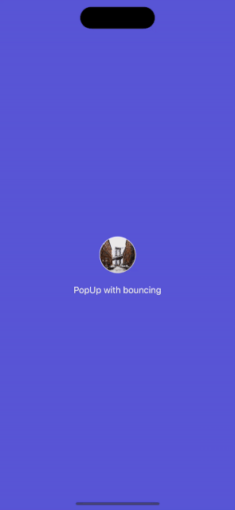

# PopUpSwift

 [](https://github.com/apple/swift-package-manager)

Beautiful `PopUpView` that supports portrait and landscape orientation, with flexible view settings.

## Gifs
 

## Screenshots


## Installation
### [Swift Package Manager](https://swift.org/package-manager/)

Going to Xcode `File` > `Add Packages...` and add the repository by giving the URL `https://github.com/bullinnyc/PopUpSwift`  
Enjoy!

## Usage

 ```swift
 import PopUpSwift
 ```

### Quick start with use ready-made shapes

 ```swift
let singleLineExampleText = "Life is like a box of chocolates, you never know what you’re gonna get."

let multiLineExampleText = """
Life is like a box of
chocolates,
you never know what you’re gonna
get.
"""

// PopUp with light style (default).
PopUpView(
    shape: .circle,
    shapeColor: .mint,
    text: singleLineExampleText
) {
    print("Do something on tapped on the popup.")
}

// PopUp with custom style.
PopUpView(
    shape: .heart,
    shapeColor: .pink,
    text: multiLineExampleText,
    popUpType: .bottom
)
.popUpStyle(
    .customPopUpStyle(
        textColor: .white,
        backgroundColor: .red
    )
)

// PopUp with dark style.
PopUpView(
    shape: .circle,
    shapeColor: .white,
    text: singleLineExampleText
) {
    print("Do something on tapped on the popup.")
}
.popUpStyle(.darkPopUpStyle)
 ```

### Start with custom view

 ```swift
let singleLineExampleText = "Life is like a box of chocolates, you never know what you’re gonna get."

let multiLineExampleText = """
Life is like a box of
chocolates,
you never know what you’re gonna
get.
"""

// Create any view.
let image = Image("BrooklynBridge")
    .resizable()
    .aspectRatio(contentMode: .fill)
    .clipShape(Circle())
    .overlay(
        Circle()
            .stroke(.white.opacity(0.8), lineWidth: 0.9)
    )
    .frame(width: 60, height: 60)

// PopUp with light style (default).
PopUpView(
    anyView: AnyView(image),
    text: singleLineExampleText
) {
    print("Do something on tapped on the popup.")
}

// PopUp with custom style.
PopUpView(
    anyView: AnyView(image),
    text: multiLineExampleText,
    popUpType: .bottom
)
.popUpStyle(
    .customPopUpStyle(
        textColor: .white,
        backgroundColor: .secondary
    )
)

// PopUp with dark style.
PopUpView(
    anyView: AnyView(image),
    text: singleLineExampleText
) {
    print("Do something on tapped on the popup.")
}
.popUpStyle(.darkPopUpStyle)
 ```

### Sets the style of `PopUpView`
**Note:** Default PopUp style is set to `light`. You can try other styles or create your own style.

 ```swift
.customPopUpStyle
.darkPopUpStyle
.newYorkPopUpStyle
 ```

## Requirements
- iOS 14.0 +
- [SwiftUI](https://developer.apple.com/xcode/swiftui/)

## License
- PopUpSwift is distributed under the MIT License.
